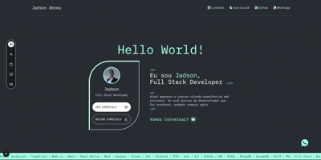

# 🚀 Portfolio - Jadson

<div align="center">



[](https://nextjs.org/)
[](https://react.dev/)
[](https://www.typescriptlang.org/)
[](https://tailwindcss.com/)

**Portfolio interativo moderno construído com as tecnologias mais recentes do ecossistema React.**

[🌐 Ver Demo](https://jadsondev.com) • [📧 Contato](mailto:contato@jadsondev.com)

</div>

---

## ✨ Destaques

- 🎨 **Design Moderno** — Interface elegante com animações fluidas e experiência imersiva
- 📱 **Responsivo** — Adaptação perfeita para desktop, tablet e mobile
- ⚡ **Alta Performance** — Otimizado com Next.js 15 Turbopack e React 19
- 🖱️ **Scroll Inteligente** — Navegação suave entre seções com scroll customizado no desktop
- 🎬 **Showcase de Projetos** — Galeria interativa com vídeos de demonstração dos projetos

---

## 🛠️ Stack Tecnológica

| Categoria | Tecnologias |
|-----------|-------------|
| **Frontend** | React 19, Next.js 15, TypeScript |
| **Estilização** | Tailwind CSS 4, CSS Modules |
| **Tooling** | ESLint, Turbopack |
| **Deploy** | Vercel |

---

## 📂 Estrutura do Projeto

```
src/
├── app/              # App Router (Next.js 15)
├── components/       # Componentes React reutilizáveis
│   ├── hero/         # Seção inicial com apresentação
│   ├── about/        # Seção sobre mim
│   ├── experiences/  # Experiências profissionais
│   ├── projects/     # Showcase de projetos
│   ├── contact/      # Formulário de contato
│   └── footer/       # Rodapé
├── hooks/            # Custom React Hooks
├── context/          # Context API para estado global
├── types/            # Definições TypeScript
└── utils/            # Funções utilitárias
```

---

## 🚀 Executando Localmente

```bash
# Clone o repositório
git clone https://github.com/Jadson-Js/portfolio.git

# Acesse a pasta do projeto
cd portfolio

# Instale as dependências
npm install

# Execute o servidor de desenvolvimento
npm run dev
```

Acesse [http://localhost:3000](http://localhost:3000) no seu navegador.

---

## 📸 Seções

| Seção | Descrição |
|-------|-----------|
| **Hero** | Apresentação inicial com call-to-action |
| **Sobre** | Informações pessoais e stack de tecnologias |
| **Experiências** | Timeline das experiências profissionais |
| **Projetos** | Galeria interativa dos principais projetos |
| **Contato** | Formulário e links para redes sociais |

---

## 🎯 Projetos em Destaque

Alguns dos projetos apresentados no portfolio:

- 🏍️ **Bikcraft** — E-commerce de bicicletas elétricas
- 📝 **Blog Pessoal** — Plataforma de artigos técnicos
- 💰 **CashBox** — Sistema de gestão financeira
- 📍 **GeoCheck** — Aplicativo de check-in geolocalizado
- 🎓 **Pronto Capacitação** — Plataforma de cursos online
- 🏙️ **Urbanify** — Sistema de gestão urbana

---

## 👨‍💻 Sobre o Desenvolvedor

**Jadson** — Desenvolvedor Full Stack apaixonado por criar experiências web incríveis.

**Stack principal:**
- TypeScript | Node.js | React | React Native | Next.js
- MySQL | MongoDB | DynamoDB
- Jest | Testing Library

---

## 📄 Licença

Este projeto está sob a licença MIT. Veja o arquivo [LICENSE](LICENSE) para mais detalhes.

---

<div align="center">

**Feito com ❤️ e muito ☕**

</div>
